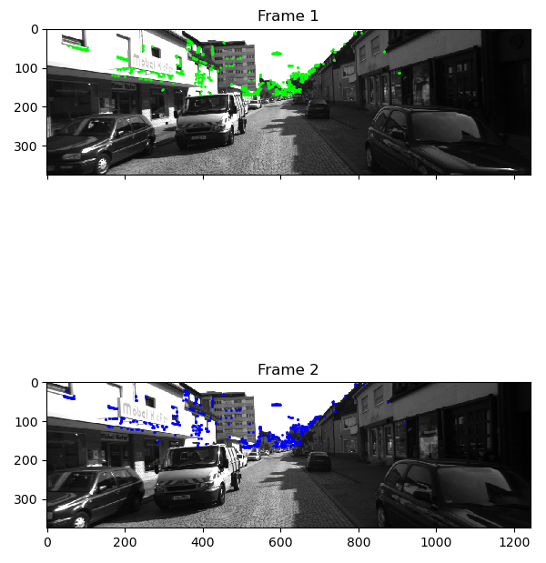

# Visual Inertial SLAM
Dependencies:
```bash
pip install onnxruntime onnx opencv-python numpy
```

KITTI dataset files are present in `dataset/`

Run this excecutable,
```bash
./run
```

Visualize,
```bash
./plot match
./plot screen
./plot world
```

# Testing

```
Recovered pose :
R:
   0.999832  0.015982 -0.008951
  -0.017687  0.969427 -0.244741
   0.004766  0.244858  0.969547
t: [-0.009873, -0.054173, 0.047719]
```
## Matched corners


## Screen space points


## Estimated point cloud (World)

